# CRM User Workflow Guide

## 1. CRM Overview
The Red Apple Learning CRM is a day-to-day operations system that helps teams manage the full journey of a student or institutional opportunity, from first inquiry to admission, payment, and reporting.

What this CRM is used for:
- Capture and organize leads from campaigns, calls, referrals, and partnerships.
- Assign leads to telecallers and counselors for follow-up and conversion.
- Track walk-ins, counseling outcomes, joining plans, and admissions.
- Manage payment collection, invoicing, and finance approvals.
- Manage institutional alliances (schools, colleges, universities) and partnership pipeline.
- Give leaders live visibility into team performance, revenue, and bottlenecks.

Main business objectives:
- Increase lead-to-admission conversion.
- Improve follow-up discipline and response speed.
- Ensure payment and invoice processes are controlled and auditable.
- Improve collaboration between marketing, operations, counseling, alliance, and accounts.
- Provide leadership with clear KPIs for fast decisions.

How departments collaborate in the CRM:
- Marketing creates and tracks campaigns and lead quality.
- Telecalling qualifies and nurtures leads.
- Counseling converts qualified leads into admissions.
- Accounts manages collections, invoices, and financial accuracy.
- Alliance team builds institutional partnerships and generates B2B pipeline.
- Admin and Owner monitor quality, productivity, and exceptions.

Overall business flow:
- Lead captured -> qualification -> counseling -> admission -> payment collection -> invoice and reporting.
- Parallel B2B flow: institution identified -> meetings -> proposal -> closure -> program launch.

## 2. User Roles & Responsibilities

## Telecaller
### Main Responsibilities
- Contact assigned leads quickly.
- Understand student interest and intent.
- Record call outcomes and schedule follow-ups.
- Move lead to next suitable stage (for example, counseling).

### Daily Activities
- Work from Smart Queue and due follow-ups.
- Log each call outcome.
- Schedule callback or next step.
- Escalate hot/qualified leads to counselor workflow.

### What They Can Access
- Telecalling dashboard and workspace.
- Assigned leads only.
- Personal follow-up queue and call history.

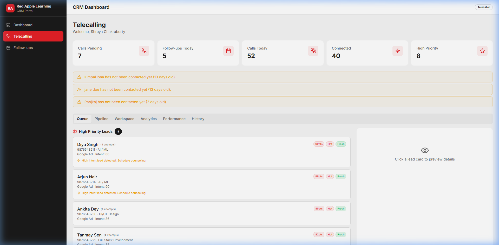

### What Happens After Their Work
- Lead status and notes become visible to counselors and managers.
- Qualified or interested leads move toward counseling and admission.

## Academic Counselor
### Main Responsibilities
- Conduct counseling for qualified leads and walk-ins.
- Capture counseling outcome, joining plan, and documentation status.
- Track student readiness for admission.
- Coordinate with Accounts for payment and billing steps.

### Daily Activities
- Review scheduled and completed walk-ins.
- Update outcome, expected joining date, and fee commitment.
- Schedule counselor follow-ups.
- Track delayed joining and resolve blockers.

### What They Can Access
- Counseling dashboard, leads, follow-ups, admissions.
- Billing-related counselor tools (collections and PI follow-up view).

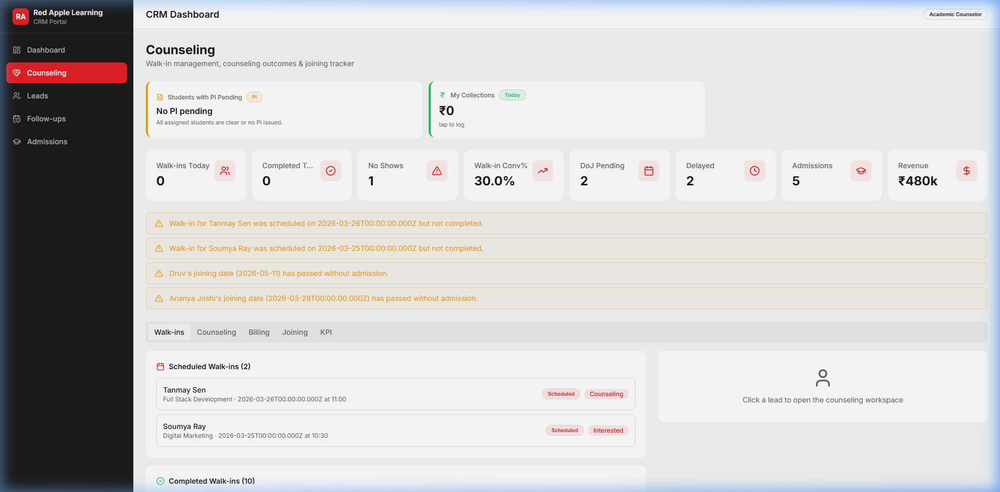

### What Happens After Their Work
- Leads move to admission, delayed, or lost journeys.
- Admission and payment processing begins through Accounts workflows.

## Marketing Manager
### Main Responsibilities
- Plan and monitor campaigns.
- Track source-wise lead quality and conversion.
- Improve spend efficiency and acquisition performance.

### Daily Activities
- Review campaign spend, leads, CPL, conversion trends.
- Create/update campaign setups.
- Monitor source performance and ROI indicators.

### What They Can Access
- Campaigns, leads, revenue analytics views.

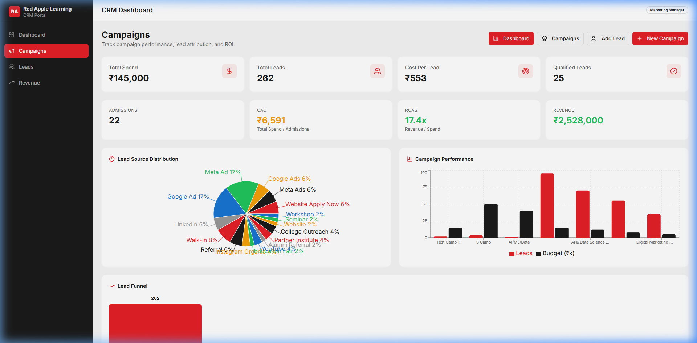

### What Happens After Their Work
- Better targeting and source quality improve telecalling and counseling outcomes.

## Admin
### Main Responsibilities
- Supervise operations across teams.
- Manage users and role assignments.
- Monitor telecalling productivity and pipeline health.
- Control process quality and policy compliance.

### Daily Activities
- Review pipeline summary and bottlenecks.
- Monitor pending and missed follow-ups.
- Manage users (add/edit/remove).
- Resolve operational escalations.

### What They Can Access
- Cross-functional dashboard.
- Leads, campaigns, telecalling, counseling, accounts, approvals, admissions.

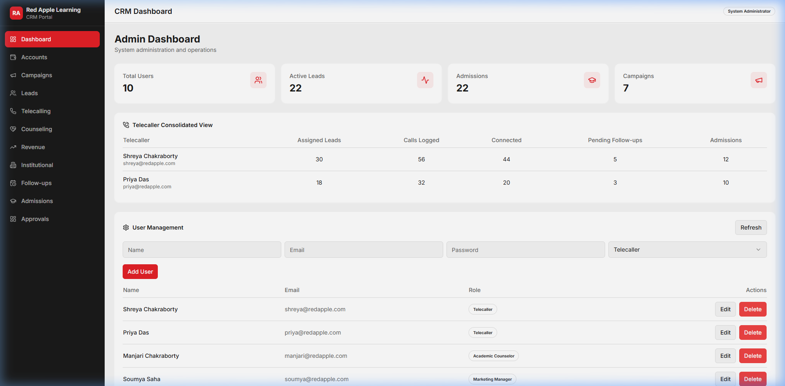

### What Happens After Their Work
- Process issues are corrected quickly.
- Team accountability and data quality improve.

## Owner
### Main Responsibilities
- Monitor full business performance.
- Review strategic KPIs (conversion, revenue, cashflow, pipeline).
- Ensure targets are met across departments.

### Daily Activities
- Review dashboards across telecalling, counseling, marketing, and accounts.
- Track operational risk areas and overdue items.
- Review performance trends and growth opportunities.

### What They Can Access
- Full system visibility and cross-module reporting.

### What Happens After Their Work
- Strategic decisions are made on hiring, budgets, campaign focus, and process priorities.

## Alliance Executive
### Main Responsibilities
- Manage assigned institutional accounts.
- Log visits, contacts, tasks, proposals, and expenses.
- Push accounts through the partnership pipeline.

### Daily Activities
- Follow route planner and daily visit list.
- Update visit notes and follow-up dates.
- Submit proposals and capture events.
- Submit expense claims.

### What They Can Access
- Alliance executive dashboard and assigned accounts.

### What Happens After Their Work
- Institutional opportunities progress toward MoU and launch.
- Alliance manager gets updated field intelligence.

## Alliance Manager
### Main Responsibilities
- Own alliance pipeline performance.
- Coach executives and remove blockers.
- Monitor proposal movement, closures, and account risk.

### Daily Activities
- Review funnel, district performance, and leaderboard.
- Review at-risk accounts and overdue follow-ups.
- Approve/guide proposals and expense flows.

### What They Can Access
- Full alliance command dashboard and reports.

### What Happens After Their Work
- Partnership closure rate improves and pipeline leakages reduce.

## Accounts Executive
### Main Responsibilities
- Execute billing operations.
- Process invoice-related queues and pending finance tasks.
- Support verification and payment records.

### Daily Activities
- Review open/overdue invoices.
- Work on payment and expense records.
- Support draft/processing steps in invoice workflow.

### What They Can Access
- Accounts dashboard and accounts workspace.

### What Happens After Their Work
- Financial transactions become ready for manager review/closure.

## Accounts Manager
### Main Responsibilities
- Own finance accuracy and closure.
- Oversee invoicing, verification, and finance compliance.
- Approve key financial actions.

### Daily Activities
- Review "Awaiting Verification" queue.
- Approve/Reject collections.
- Generate invoices for verified payments.
- Track overdue payments.

### What They Can Access
- Accounts dashboard, collections, invoices, and financial reports.

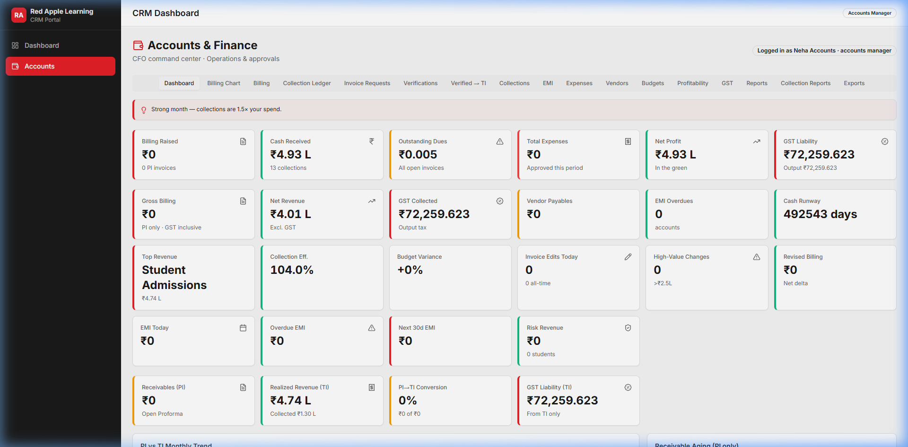

### What Happens After Their Work
- Financial records are updated, and the student's admission is formally closed from a billing perspective.

## 3. Complete Lead Workflow
Lead workflow in simple sequence:
- Lead Generated -> Lead Assigned -> Telecaller Follow-up -> Counselor Discussion -> Marketing Tracking -> Alliance Coordination (where relevant) -> Payment Processing -> Admission/Closure -> Reporting

Detailed lifecycle:
1. Lead Generated
- Owner/Marketing/operations sources create lead entries.
- Key details captured: name, contact, source, course interest, campaign links.
- Typical status starts at `New`.

2. Lead Assigned
- Lead is assigned to telecaller.
- Ownership and priority are set.

3. Telecaller Follow-up
- Telecaller calls and records outcomes.
- Updates status such as `Contacted`, `Connected`, `Follow-up`, `Interested`.
- Adds notes, objections, and next follow-up date.
- Schedules walk-in when lead is ready.

4. Counselor Discussion
- Counselor handles walk-in/counseling.
- Records counseling outcome, joining plan, and fee commitment.
- Updates document readiness and joining risks.
- Lead moves toward `Qualified` and `Admission`.

5. Marketing Tracking
- Marketing tracks source-to-conversion quality.
- Campaign performance is reviewed to improve future lead quality.

6. Alliance Coordination (if lead came from institutional channel)
- Alliance team tracks institution-level engagement.
- Visit/proposal/program actions are recorded.

7. Payment Processing
- Collections are recorded with payment mode and purpose.
- Verification and invoice-request steps pass through approval flow.
- Accounts issues invoice and tracks dues/receipts.

8. Admission / Closure
- Confirmed students are recorded as admissions.
- Payment status tracked as Pending/Partial/Paid.
- Non-converting leads are marked lost with reason.

9. Reporting
- Role dashboards show funnel position, pending actions, and performance.
- Leadership reviews conversion, revenue, and risk trends.

## 4. Department-wise Workflow

## Telecalling Workflow
- Starting point: Assigned leads + today’s follow-up queue.
- Daily process: Call -> outcome logging -> follow-up scheduling -> stage update.
- Important activities: Smart queue prioritization, hot lead escalation, callback discipline.
- Escalation flow: High intent or counseling-ready lead moves to counselor.
- Reporting flow: Calls made, connected calls, follow-up compliance, conversion contribution.
- Completion flow: Lead either progresses to counseling/admission or is marked lost.

## Counseling Workflow
- Starting point: Counseling-assigned leads and walk-in schedule.
- Daily process: Conduct counseling -> update outcome -> set joining plan -> track docs.
- Important activities: DoJ planning, fee commitment, delayed joining watchlist.
- Escalation flow: Delayed/no-show/document blockers escalated via follow-up and management review.
- Reporting flow: Walk-in conversion, admissions count, counselor revenue contribution.
- Completion flow: Lead admitted, rescheduled, or closed.

## Marketing Workflow
- Starting point: Campaign setup and active source performance.
- Daily process: Track spend/leads/CPL/quality -> adjust campaign strategy.
- Important activities: Source quality tracking and budget decisions.
- Escalation flow: Low-performing campaign flagged for correction.
- Reporting flow: ROI indicators and source-wise conversions.
- Completion flow: Campaign optimized, paused, or completed.

## Alliance Workflow
- Starting point: Institution pipeline (`Identified` onward).
- Daily process: Visits, contacts, tasks, proposals, events, expenses.
- Important activities: Follow-up discipline, proposal movement, closure push.
- Escalation flow: At-risk accounts and overdue follow-ups escalated to manager.
- Reporting flow: Funnel, district performance, executive leaderboard, forecast.
- Completion flow: MoU signed/program launched or account marked lost.

## Accounts Workflow
- Starting point: Collections, invoice requests, open dues, pending expenses.
- Daily process: Verify records -> process invoice queues -> monitor dues/overdues.
- Important activities: Invoice status management, collection verification, payment posting.
- Escalation flow: Clarification/hold/rejection for incomplete or mismatched records.
- Reporting flow: Billed vs collected, outstanding, overdue, pending expense queues.
- Completion flow: Invoice issued, dues cleared, records closed.

## Admin Workflow
- Starting point: Daily cross-team operations dashboard.
- Daily process: Monitor team KPIs, pipeline health, follow-up adherence.
- Important activities: User management, issue resolution, process correction.
- Escalation flow: Operational delays are pushed to role owners.
- Reporting flow: Team-level performance and bottleneck tracking.
- Completion flow: Exceptions closed and operations normalized.

## Owner Monitoring Workflow
- Starting point: Consolidated executive dashboards.
- Daily process: Review performance, risks, and revenue trends.
- Important activities: Strategic decision making and prioritization.
- Escalation flow: Cross-functional escalations to department heads.
- Reporting flow: End-to-end business health view.
- Completion flow: Direction and targets updated for teams.

## 5. Daily Workflow Examples

## Example 1: New Student Inquiry
1. A new lead enters from a digital campaign.
2. Lead is assigned to a telecaller.
3. Telecaller makes first call and updates status to `Connected`.
4. Student shows interest; follow-up scheduled.
5. Telecaller schedules walk-in and marks lead for counseling.
6. Counselor conducts discussion and records expected joining date.
7. Student confirms fee plan.
8. Admission record is finalized.
9. Payment and invoice process starts in Accounts.

## Example 2: Follow-up Process
1. Telecaller/counselor sees due follow-ups on dashboard.
2. Call is made and outcome captured.
3. If student asks for time, new follow-up date is scheduled.
4. If student is ready, lead progresses toward counseling/admission.
5. Missed follow-ups appear as overdue alerts.

## Example 3: Payment Collection Workflow
1. Counselor logs collection details (amount, mode, reason).
2. Collection enters verification/approval path.
3. Admin/accounts review and validate payment record.
4. Invoice request moves through review steps.
5. Accounts issues invoice.
6. Record is marked completed/invoice generated.

## Example 4: Alliance Partner Coordination
1. Alliance executive logs meeting with an institution.
2. Interest level and next follow-up are recorded.
3. Proposal is prepared and sent.
4. Manager reviews pipeline movement and risk.
5. Institution progresses to MoU stage or remains in negotiation.

## 6. Dashboard & Reports Explanation
Role-level visibility:
- Telecaller: assigned leads, calls, due follow-ups, high-priority leads.
- Counselor: walk-ins, counseling queue, DoJ tracker, admissions and revenue contribution.
- Marketing Manager: campaign spend, leads, CPL, conversion trends, ROI indicators.
- Alliance Executive: today’s visits, follow-ups, account list, quick action panel.
- Alliance Manager: funnel, leaderboard, at-risk accounts, district-level insights.
- Accounts Executive/Manager: billed, collected, outstanding, overdue, pending expense/invoice queues.
- Admin/Owner: cross-functional KPI summary and operational oversight.

Important report categories:
- Lead funnel and status aging.
- Follow-up compliance and overdue workload.
- Campaign/source conversion quality.
- Admission and payment conversion.
- Finance outstanding and overdue analysis.
- Alliance pipeline and closure forecast.

## 7. Notification & Reminder Flow
The CRM highlights important actions through queue cards, pending widgets, and status alerts.

Typical reminders:
- Follow-up reminders: due/overdue follow-ups for telecallers and counselors.
- Task alerts: alliance tasks and visit follow-ups.
- Pending payments: dues and overdue invoices in Accounts.
- Lead assignment notifications: workload appears in assigned user queue.
- Escalation alerts: stale leads, delayed joining, overdue follow-ups, proposal delays.

Note:
- Some alerting is dashboard/widget based rather than a full automated notification center.
- This process appears partially implemented in the current CRM.

## 8. Lead Status & Meaning

| Status | Meaning | Who Updates It | Next Step |
|---|---|---|---|
| New | Fresh lead captured | Marketing/Telecaller/Admin | First contact attempt |
| Contact Attempted | Tried reaching lead | Telecaller | Retry or schedule callback |
| Contacted | Initial contact made | Telecaller | Understand interest level |
| Connected | Live conversation happened | Telecaller | Qualify and move forward |
| Interested | Lead expressed clear interest | Telecaller | Schedule counseling/walk-in |
| Follow-up | Needs future touchpoint | Telecaller/Counselor | Follow-up on due date |
| Application Submitted | Student applied | Telecaller/Counselor | Interview/counseling continuation |
| Interview Scheduled | Interview planned | Telecaller/Counselor | Conduct interview |
| Interview Completed | Interview done | Telecaller/Counselor | Counseling/decision |
| Counseling | Under counselor discussion | Counselor | Set DoJ/fee plan |
| Qualified | Fit and ready to convert | Counselor | Admission + payment process |
| Admission | Converted to student | Counselor/Admissions | Payment and invoice closure |
| Lost | Did not convert | Telecaller/Counselor/Manager | Capture reason and close |

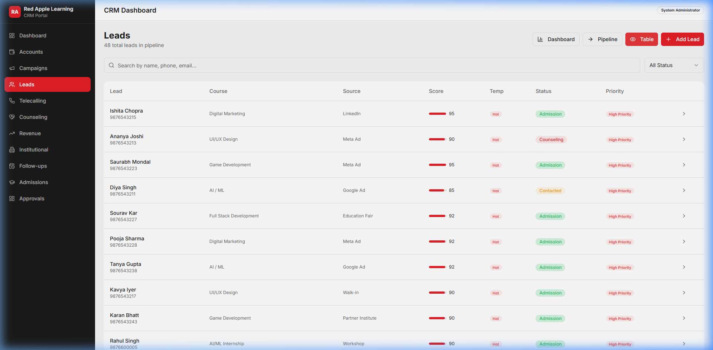

Additional operational statuses used in payments/finance:
- Collection statuses: `Collected`, `Awaiting Verification`, `Verified`, `Mismatch`, `Rejected`, `Ready For Invoice`, `Invoice Generated`.
- Admission payment statuses: `Pending`, `Partial`, `Paid`.

## 9. Communication Flow Between Departments
- Telecaller -> Counselor:
  - Shares qualified lead context, objections, and urgency.
  - Counselor uses this to personalize conversion conversation.

- Counselor -> Accounts:
  - Sends admission/payment readiness and collection details.
  - Accounts completes verification and invoice processing.

- Marketing -> Telecalling/Counseling:
  - Provides campaign/source insights to improve pitch and follow-up strategy.

- Marketing -> Alliance Team:
  - Coordinates institutional campaign intent and event/pipeline opportunities.

- Admin -> All Departments:
  - Tracks productivity, resolves process issues, and enforces discipline.

- Owner -> Leadership Layer:
  - Uses overall KPIs to set priorities and growth direction.

## 10. Admin & Owner Controls
Admin controls:
- User and role management.
- Operational monitoring across modules.
- Telecaller productivity and pipeline review.
- Exception handling and process correction.

Owner controls:
- Full business oversight across all roles.
- Strategic KPI review and performance comparisons.
- Revenue, pipeline, and risk monitoring.
- Cross-functional escalation and decision making.

## 11. Business Rules & Best Practices
Lead assignment rules:
- Every lead must have a clear owner and assigned telecaller.
- Priority leads should be contacted first.

Follow-up rules:
- Every meaningful call should end with a next action.
- Overdue follow-ups must be cleared daily.

Escalation rules:
- Hot/qualified leads should be escalated quickly to counseling.
- Delayed joining and no-show patterns require manager attention.

Payment handling rules:
- Record payment details accurately at first entry.
- Verification and invoice actions must follow role workflow.

Data update responsibility:
- Telecaller owns call outcome quality.
- Counselor owns conversion documentation.
- Accounts owns finance accuracy and closure.

Duplicate lead handling:
- Before creating a lead, check existing contact details.
- If duplicate exists, update existing lead record rather than creating a new one.

## 12. Common User Scenarios
Missed follow-up:
- System shows overdue reminder.
- User contacts lead immediately and updates status.
- Manager reviews repeated misses.

Duplicate lead:
- Merge/continue from existing record.
- Keep one active owner to avoid confusion.

Incorrect payment entry:
- Record moves to mismatch/clarification path.
- Correct details and continue verification.

Lead reassignment:
- Ownership transferred with reason.
- New owner continues from latest activity timeline.

User inactivity:
- Dashboard KPIs reveal low call/follow-up activity.
- Admin/manager intervenes and rebalances workload.

Escalation handling:
- High-risk or stale cases are surfaced via alerts.
- Team lead assigns immediate corrective action.

## 13. Simple Workflow Diagrams

### Overall CRM Workflow
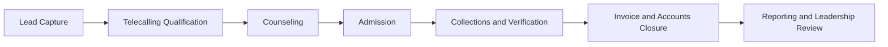

### Lead Lifecycle
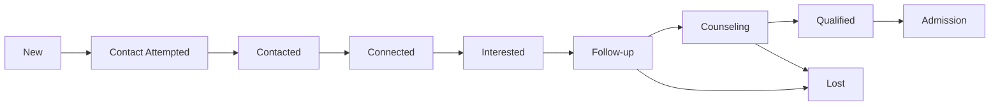

### Payment Workflow
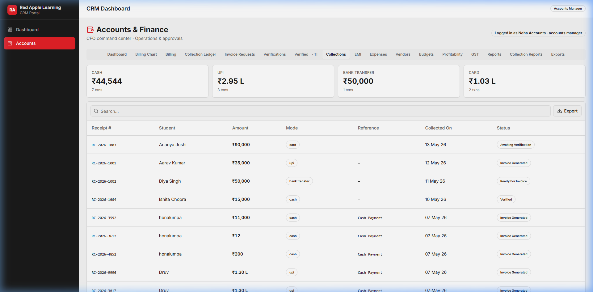

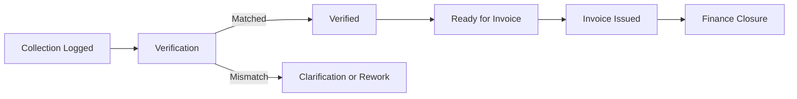

### Department Interaction Flow
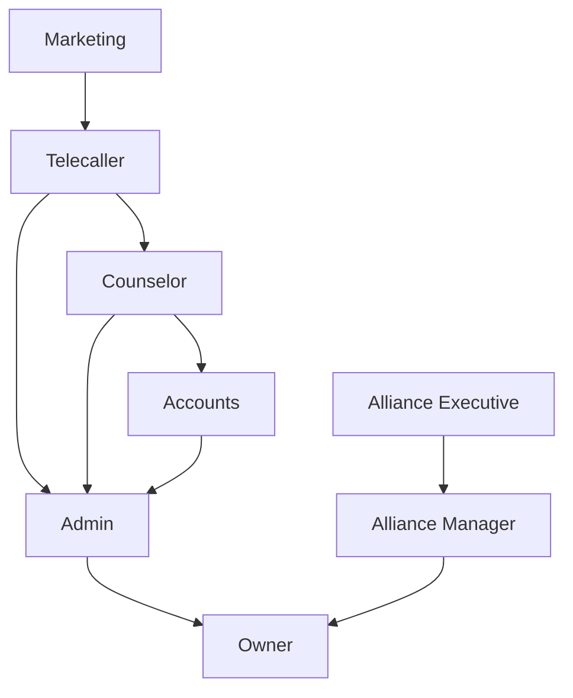

## 14. Training Notes for New Employees
How to use the CRM (beginner path):
1. Log in with your role account.
2. Open your dashboard and focus on due items first.
3. Update records immediately after each action.
4. Keep notes short, clear, and factual.
5. Move status only when the lead truly reaches that stage.

Daily checklist:
- Clear overdue follow-ups.
- Process high-priority leads first.
- Update today’s activity notes.
- Escalate blockers before end of day.
- Review your KPI cards before logout.

Best practices:
- Use one source of truth: always update CRM first.
- Keep timelines accurate to avoid cross-team confusion.
- Use clear handoff notes when transferring to another team.

Common mistakes to avoid:
- Leaving lead status unchanged after calls.
- Skipping follow-up dates.
- Logging incomplete payment details.
- Creating duplicate lead records.

## 15. Executive Summary
This CRM runs the business as an integrated operating system:
- Marketing brings demand.
- Telecalling qualifies demand.
- Counseling converts demand.
- Accounts secures financial closure.
- Alliance builds institutional pipeline.
- Admin drives execution quality.
- Owner monitors growth, risk, and performance.

In practical terms, the CRM ensures every lead and every rupee has a visible journey, clear ownership, and measurable outcome.

Operational note on maturity:
- A few workflows still use mixed behavior between older and newer process patterns.
- This process appears partially implemented in the current CRM.
